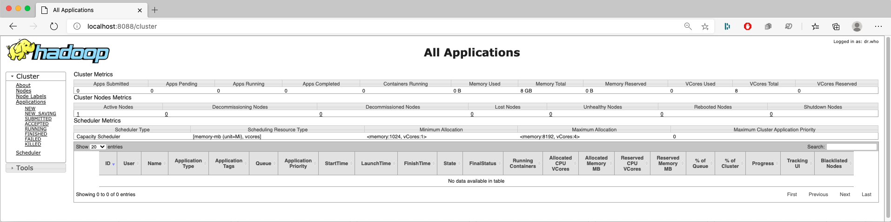

# Learning Big Data Computing with Hadoop
Homework 2 for CS 6220 Big Data Systems &amp; Analytics

### Problem 3. Learning Big Data Computing with Hadoop and/or Spark MapReduce

For this homework, I chose to complete Option 1 of Problem 3.

#### Requirements:
Installed software required to run the programs in this repository:
- Java 14.0.2
- JDK 14.0.2
- Hadoop 3.3.0
- Git 2.28.0 (optional)

#### My system description:
Specifications of the machine I used to run the programs in this repository:
- macOS Catalina (10.15.6)
- 2 GHz Quad-Core Intel Core i5 (10th Generation)
- 16 GB RAM
- 500 GB SSD
- Hadoop running on Pseudo-Distributed mode

### 1. HDFS Installation:

The first step of this homework was to setup HDFS in my local machine. In order to do so, I installed Java and Hadoop and edited the necessary configuration files.

- Hadoop version: 3.3.0
- Hadoop mode: Pseudo-Distributed (<value>1</value> on the hdfs-site.xml configuration file)
- hadoop command is available globally (hadoop binary files were added to the path)

Since, my computer was running macOS I found the following installation tutorial very helpful: https://medium.com/beeranddiapers/installing-hadoop-on-mac-a9a3649dbc4d

If you are running Windows you can follow this tutorial: https://towardsdatascience.com/installing-hadoop-3-2-1-single-node-cluster-on-windows-10-ac258dd48aef

If you running Linux, you can follow the offical Apache Hadoop documentation: https://hadoop.apache.org/docs/stable/hadoop-project-dist/hadoop-common/SingleCluster.html

 After installing HDFS, I starting all services by running the start-all.sh script on the sbin folder inside the hadoop folder.

**- Resource Manager Screenshot:**

**- JobTracker Screenshot:**

**- Node Manager Screenshot:**

### 2. MapReduce WordCount:

