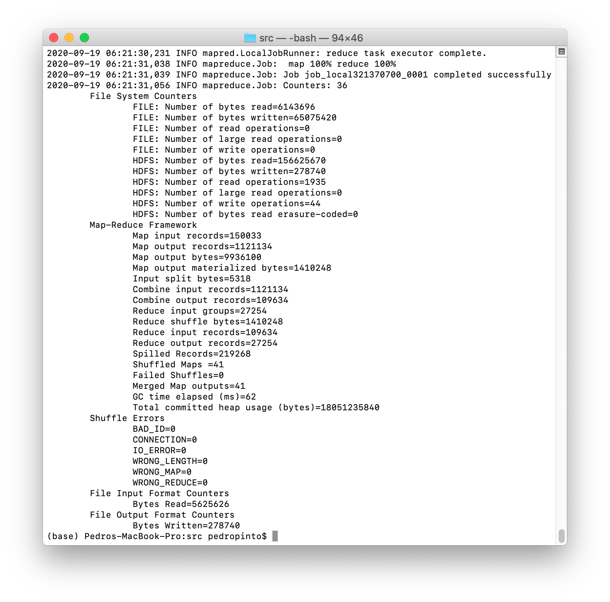
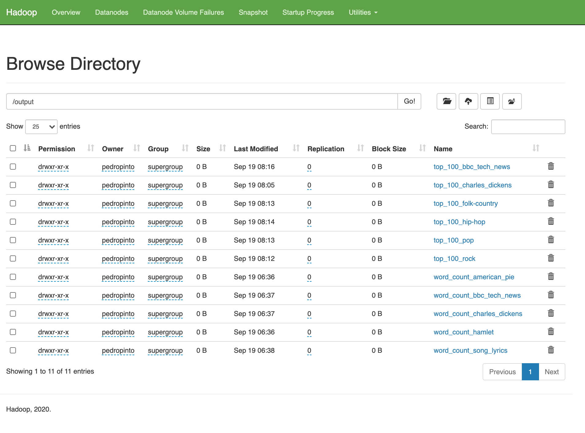

# Learning Big Data Computing with Hadoop
Homework 2 for CS 6220 Big Data Systems &amp; Analytics


### Problem 3. Learning Big Data Computing with Hadoop MapReduce

For this homework, I chose to complete Option 1 of Problem 3.

#### Requirements:
Installed software required to run the programs in this repository:
- Java 14.0.2
- JDK 14.0.2
- Hadoop 3.3.0
- Git 2.28.0 (optional)

#### My system description:
Specifications of the machine I used to run the programs in this repository:
- macOS Catalina (10.15.6)
- 2 GHz Quad-Core Intel Core i5 (10th Generation)
- 16 GB RAM
- 500 GB SSD
- Hadoop running on Pseudo-Distributed mode

#### Repository Folder Structure:
- **input:** 
    - All text inputs used for the MapReduce jobs.
- **WordCount:** 
    - Java MapReduce program to count the occurance of each word in a document or body of documents.
- **Top100Words:** 
    - Java MapReduce program to find the top 100 most common words across a body of documents.
- **output:** 
    - All outputs from the MapReduce jobs.
- **import_books:** 
    - Contains the jupyter notebook used to import books from the Gutenbert Project.
- **images:** 
    - Contains all images used in the Readme file.

### 1. HDFS Installation:

The first step of this homework was to setup HDFS in my local machine. In order to do so, I installed Java and Hadoop and edited the necessary configuration files.

- **Hadoop version:** 3.3.0
- **Hadoop mode:** Pseudo-Distributed (<value>1</value> on the hdfs-site.xml configuration file)
- **hadoop command** is available globally (hadoop binary files were added to the path)


- **Configuration File Edits:**
  - **hadoop-env.sh**:
    Make sure to set export **JAVA_HOME** to the the Java home location in your machine.
  - **core-site.xml**:

```xml
    <configuration>
      <property>
        <name>hadoop.tmp.dir</name>
        <value>/usr/local/Cellar/hadoop/hdfs/tmp</value>
        <description>A base for other temporary directories</description>             
      </property>
      <property>
        <name>fs.default.name</name>
        <value>hdfs://localhost:8020</value>
      </property>
    </configuration>
```
-
  - **mapred-site.xml**:

```xml
    <configuration>
      <property>
        <name>mapred.job.tracker</name>
        <value>localhost:8021</value>
      </property>
    </configuration>
```
-
  - **hdfs-site.xml**:

```xml
    <configuration>
      <property>
        <name>dfs.replication</name>
        <value>1</value>
      </property>
    </configuration>
```


Since, my computer was running macOS I found the following installation tutorial very helpful: https://medium.com/beeranddiapers/installing-hadoop-on-mac-a9a3649dbc4d

If you are running Windows you can follow this tutorial: https://towardsdatascience.com/installing-hadoop-3-2-1-single-node-cluster-on-windows-10-ac258dd48aef

If you running Linux, you can follow the offical Apache Hadoop documentation: https://hadoop.apache.org/docs/stable/hadoop-project-dist/hadoop-common/SingleCluster.html

 ***After installing HDFS, start all services by running the start-all.sh script on the sbin folder inside the hadoop folder.***

- **Resource Manager Screenshot:**


- **JobTracker Screenshot:**


- **Node Manager Screenshot:**


### 2. Data:

A number of different text files were used was input data for this homework. They are all saved in the input folder.

- american_pie.txt: 
  - lyrics to the song American Pie by Don McLean, obtained from https://www.letras.com/don-mclean/25411/
- hamlet.txt: 
  - William Shakespeare's famous tragedy Hamlet, obtained from https://gist.github.com/provpup/2fc41686eab7400b796b
- charles_dikens: 
  - this folder contains the 20 books published by the famous English author Charles Dickens.
  - These files were obtained from *Project Gutenberg* using the Gutenberg python library to fetch the data.
  - You can run the Jupyter notebook /import_books/import_charles_dickens_books.ipynb to understand the process.
- bbc_tech_news:
  - This folder contains 401 news articles by BBC on the topic of Technology.
  - The data was obtained from http://mlg.ucd.ie/datasets/bbc.html
- song_lyrics:
  - This data set contains the lyrics of songs by a number of different aritsts. For each artist, all of his or her lyrics were saved as a single txt file.
  - The data was obtained from https://www.kaggle.com/paultimothymooney/poetry
  - I manually subdivided the artists into four main genres:
    - Pop: 11 aritsts
    - Rock: 13 aritsts
    - Folk/Country: 6 aritsts
    - Hip-Hop: 11 aritsts
    
- Saving the data on HDFS:
  - To save the input data on HDFS, you just need to run the export_inputs.sh shell script in the root directory of the project by running the following command:
```shell
    sh export_inputs.sh
```
In my machine, the script took ~25 seconds to run.

### 3. MapReduce WordCount:

This is a classic MapReduce problem where you take a document (or group of documents) as input and output all the different words sorted alphabetically along with the number of times each one occured in the document or corpus.

- **Running the program:**
  - To run the MapReduce job, you need to change directories to WordCount/src and run the word_count.sh shell script by running the following commands from the root directory of the repository:
```shell
    cd WordCount/src
    sh word_count.sh
```
In my machine, the script took **~40 seconds** to run (including the time it takes to print all the progress reports to the terminal).

- Portion of a MapReduce successful job feedback message:


- Portion of a MapReduce WordCount job output:
```txt
    A       18
    About   1
    Above   1
    Adjourned       1
    Admire  1
    Again   1
    Ago     1
    Air     1
    All     3
    American        7
    And     37
    Angel   1
    As      2
    Asked   1
    Away    1
    Bad     1
    Band    1
    Be      17
    Been    1
```
- **Performance Analysis:**

|     Dataset     |  Size  | # of Files | Time Elapsed | # of Unique Words |
|:---------------:|:------:|:----------:|:------------:|:-----------------:|
|   American Pie  |  4 KB  |      1     |     3 ms     |        313        |
|      Hamlet     | 192 KB |      1     |     5 ms     |        4835       |
| Charles Dickens | 6.4 MB |     20     |     37 ms    |       45,331      |
|  BBC Tech News  | 1.2 MB |     401    |    183 ms    |       12,673      |
|   Song Lyrics   | 5.6 MB |     41     |     51 ms    |       27,254      |


### 4. MapReduce Top100Words:

This is a more complicated MapReduce problem where you take group of documents (corpus) as input and output **Top 100 words ranked in 3 different ways**:
  - First, by the number of files in the corpus where that word appears.
  - Second, by the total number of times that word appears in the corpus (in case multiple words appear on the same number of files).
  - Third, sort the words alphabetically (as a final tie-breaker if necessary).
  
The final output will contain **100 words** displaying the number of documents where it appears and total number of occurances in the corpus separated by tabs (e.g.: **World   33   215**) 

- **Running the program:**
  - To run the MapReduce job, you need to change directories to Top100Words/src and run the top_100_words.sh shell script by running the following commands from the root directory of the repository:
```shell
    cd Top100Words/src
    sh top_100_words.sh
```

In my machine, the script took **~45 seconds** to run (including the time it takes to print all the progress reports to the terminal).

- Portion of a MapReduce Top100Words job output:
```txt
    Such	201	377
    Technology	196	504
    Us	178	366
    Mr	175	509
    Users	173	407
    Being	169	279
    Because	159	246
    Used	156	281
    Using	152	238
    Those	149	251
    Digital	139	373
    Computer	136	299
    Last	135	186
    Million	134	253
    Online	133	307
```

- **Performance Analysis:**

|       Dataset       |  Size  | # of Files | Time Elapsed |
|:-------------------:|:------:|:----------:|:------------:|
|   Charles Dickens   | 6.4 MB |     20     |     58 ms    |
|    BBC Tech News    | 1.2 MB |     401    |    149 ms    |
|      Pop Lyrics     | 1.4 MB |     11     |     27 ms    |
|     Rock Lyrics     | 1.4 MB |     13     |     34 ms    |
| Folk/Country Lyrics | 672 KB |      6     |     18 ms    |
|    Hip-Hop Lyrics   | 2.2 MB |     11     |     31 ms    |


### Final View of my HDFS Dashboard:


